# Remote File Source - Visual Diagrams

This document contains Mermaid diagrams for the Remote File Source feature. These diagrams can be rendered in GitHub, GitLab, or any Mermaid-compatible viewer.

## System Architecture

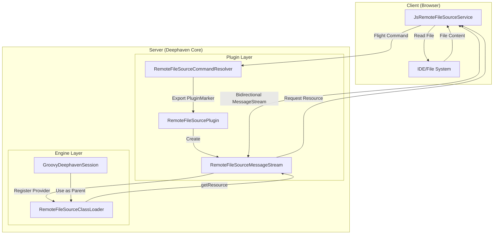

## Component Class Diagram

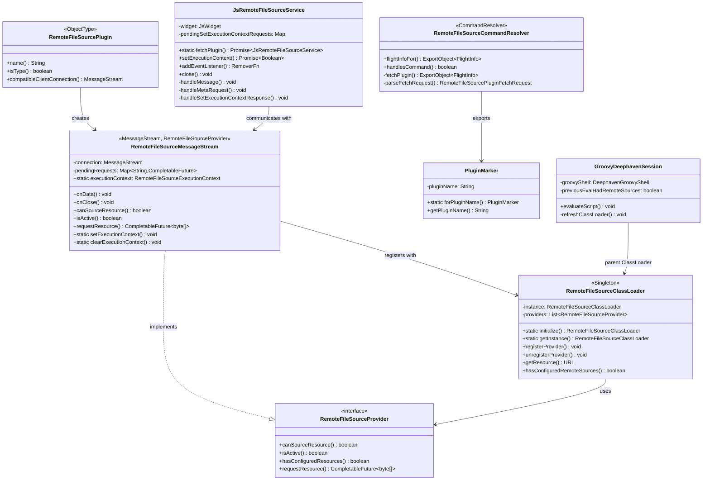

## Sequence: Initial Connection Setup

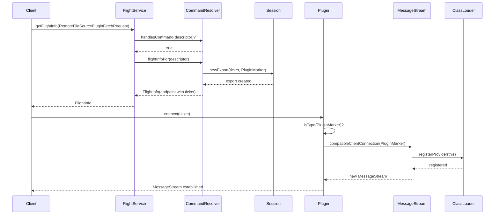

## Sequence: Execution Context and Script Execution

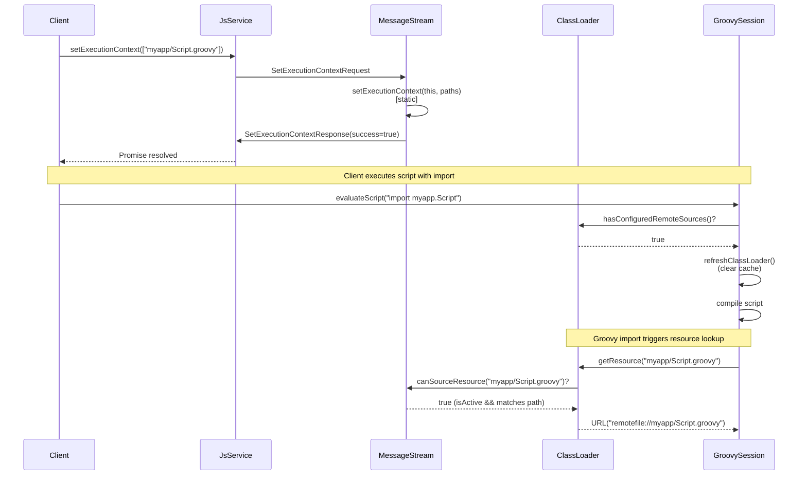

## Sequence: Resource Fetch Flow

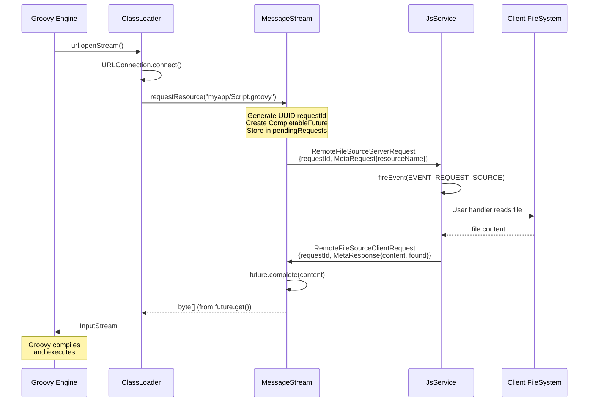

## State Diagram: MessageStream Lifecycle

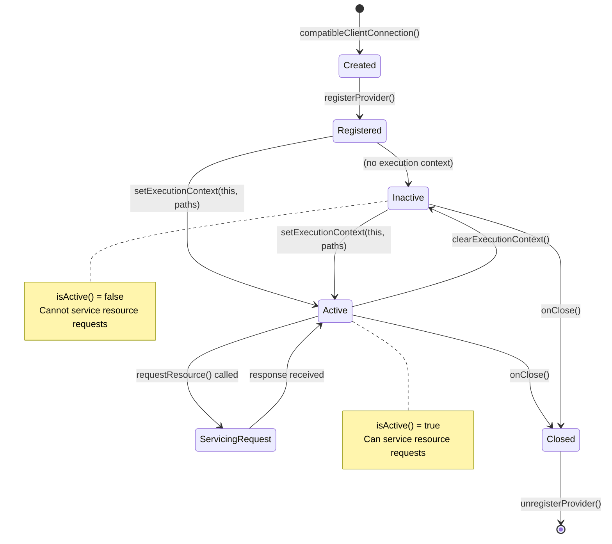

## State Diagram: Cache Management

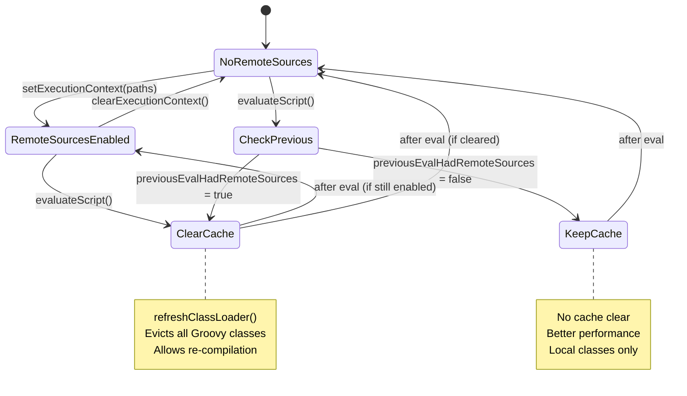

## Data Flow: Protobuf Messages

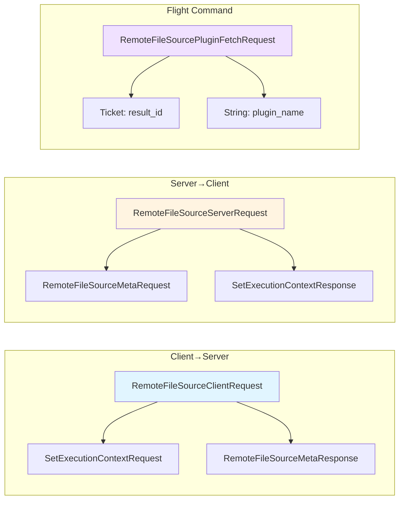

## Activity Diagram: Complete Workflow

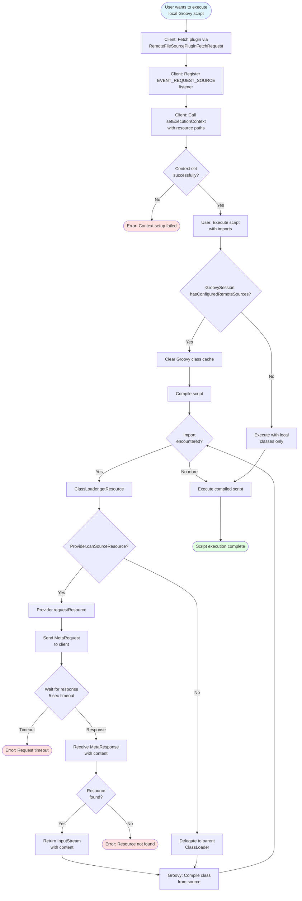

## Component Dependencies

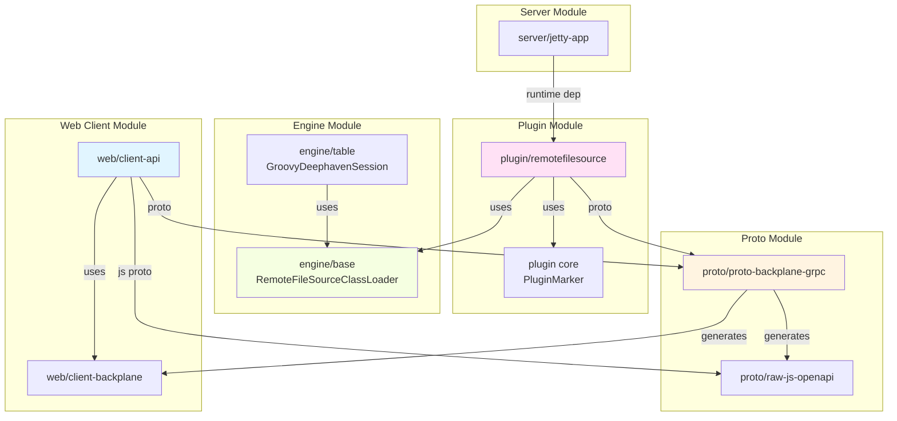

## Message Flow Timing

```mermaid
gantt
    title Remote File Source Request Timeline
    dateFormat X
    axisFormat %L ms
    
    section Client
    Fire setExecutionContext :a1, 0, 50
    Wait for ack :a2, 50, 100
    Execute script :a3, 100, 150
    Receive resource request :a4, 250, 300
    Read file :a5, 300, 450
    Send response :a6, 450, 500
    
    section Network
    Context request transit :b1, 50, 75
    Context ack transit :b2, 125, 150
    Resource request transit :b3, 200, 250
    Resource response transit :b4, 500, 550
    
    section Server
    Receive context request :c1, 75, 100
    Send context ack :c2, 100, 125
    Start script compilation :c3, 150, 200
    Send resource request :c4, 200, 250
    Wait for response :c5, 250, 550
    Complete compilation :c6, 550, 600
    Execute script :c7, 600, 700
```

---

**Note:** These diagrams can be viewed in:
- GitHub/GitLab (native Mermaid rendering)
- VS Code (with Mermaid extension)
- Online: https://mermaid.live/
- IntelliJ IDEA (with Mermaid plugin)

